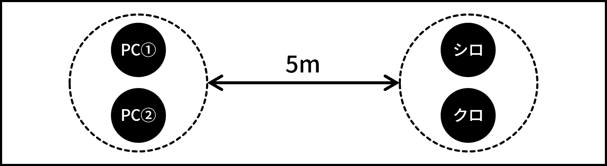

:::section-title CL-01: 日常と才能

クライマックスフェイズ・シーン1

# 日常と才能

:::

[日時] 誕生日当日・深夜

[場所] 高校・屋上

[シーンプレイヤー] PC①

## 解説

PC①とPC②が{背理天賦|イリーガルギフター}と対決するシーン。

## 描写1

深夜、キミたちが高校の屋上に向かうと、そこには既にシロとクロが待っていた。

:::serif シロ

「あなたたちの内に眠る才能を花開かせる、その準備はできましたか？」

(断ると) 「なぜ？あなたたちほどの才能を、埋もれさせておくつもりですか？」

:::

:::serif クロ

「きっとあんたたちが「理性」と呼んでいる感傷が合理的な判断の邪魔をしているんだろう。悪いけどその枷、ここで壊させてもらう。」

:::

:::rp 決意を示せ

PCふたりが選択した答えをシロとクロに突きつけ、啖呵を切る様子を自由にロールプレイする。なお、シロとクロは既にジャーム化しており、才能を目覚めさせることこそが正しい選択であると信じ切っているため、仮に説得・論破しようとしたとしても、考えを変えることはない。

十分ロールプレイを楽しんだら、描写2に移行せよ。

:::

## 描写2

キミたちが誘いを断ると、シロとクロは戦闘態勢に入る。それに呼応して、キミたちの体内のレネゲイドも活性化を始める。

:::check 衝動判定

[技能] 〈意志〉

[難易度] 8

即座に侵蝕率が2D10点上昇する。判定に失敗した場合、バッドステータスの暴走を受ける。

:::

キミたちは、高校の生徒を守るために、そしてキミたち自身の未来のために、ここで彼らを倒さなければならない。

:::battle クライマックス戦闘

##### エネミー

シロとクロ。行動は[エネミーデータ](shiro.html)の「戦闘プラン」の欄を参照してGMが決定すること。

##### 初期配置

PCふたりでひとつ、シロ・クロでひとつ、合計ふたつのエンゲージを作成する。両エンゲージ間の距離は5mとする。

{width=400}

##### 戦闘終了条件

シロ・クロ両方の戦闘不能。

:::

## 結末

シロとクロを倒したらシーン終了。バックトラックを行ってからエンディングフェイズに移行せよ。なお、本シナリオでは撃破されたエネミーが合計5つEロイスを取得していたため、希望するPCはバックトラック直前に5D10だけ侵蝕率を下げることができる。