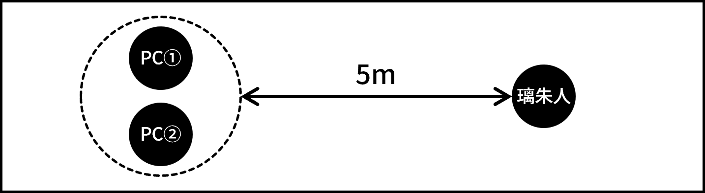

:::section-title MD-04: Illegal Gifter

ミドルフェイズ・シーン4

# Illegal Gifter

:::

[日時] 誕生日前日・夕方

[場所] 高校

[シーンプレイヤー] PC①

## 解説

PC①とPC②が渚に連れられて、魔法使いと接触した生徒に会いに行くシーン。その生徒は既にジャーム化しており、戦闘が発生する。戦闘終了後、{背理天賦|イリーガルギフター}が現れ、PC①に才能を付与しようとする。その結果、PC①、②のいずれかのシナリオロイスが消去される。

## 描写1

キミたちが今後の方針を考えていると、渚が現れる。

:::serif 渚

「あ！PC①！こんなところにいたんだ。」

「お、そちらはPC②さん？ちゃんとお話しするのは初めてかも。初めまして、PC①の友達の渚でーす。PC②さんとも仲良くなりたいなー。とりあえず連絡先交換しよ？」

「違う違う、そんな話をしに来たんじゃなくってね。実はPC①に見せたいものがあるの。PC②さんも一緒にどう？」

:::

:::rp ふたりと渚

PCふたりと渚の会話を自由にロールプレイする。渚はPC②に対しても好意的かつ積極的に接する。PC②にとっては、PC①の送る日常に触れる貴重な機会となるだろう。今後の展開次第では渚からPC②に連絡するシーンが生じうるため、忘れずにPC②と渚の連絡先を交換しておくこと。

会話を終えると、渚はPCたちを音楽室に連れて行こうとする。PC①は渚の提案を断らずについて行くこと。PC②はふたりについて行かず、その場に残ることを選択しても構わない。その場合、PC②はミドル戦闘に途中から参戦することになる。詳細はミドル戦闘の項目を参照せよ。

:::

## 描写2

キミたちは渚に連れられて、高校の音楽室を訪れる。するとそこには多くの生徒や教師が集まっており、その中心では、ひとりの男子生徒がピアノを弾いている。その演奏を耳にしたキミたちは、一瞬でそれが努力によって到達可能な域を外れたものであることを理解する。

:::serif 渚

「すごいよね、3年生の{奏|かなで} {璃朱人|りすと}先輩。」

「PC①、魔法使いの噂について調べてたみたいじゃん？もしかしたらホントに魔法使い、いるかもよ。だって奏先輩、魔法使いからピアノを弾く才能をもらったって言ってたし。」

:::

彼の奏でる音色は、これまで聴いてきたあらゆる音楽がチープに感じられるほどの感動を、魂を直接揺さぶられるような衝撃を、キミたち聴衆の胸に植え付ける。そしてそれは同時に、キミたちの体内に眠るレネゲイドウイルスまでをも呼び覚ます。このタイミングで璃朱人はEロイス《衝動侵蝕: 妄想》を使用する。

:::e-lois 《衝動侵蝕: 妄想》

[技能] 〈意志〉

[難易度] 8

即座に侵蝕率が2D10点上昇する。判定に失敗した場合、バッドステータスの暴走を受ける。さらにこの暴走を受けている間、璃朱人の演奏に聞き入ってしまい、【行動値】が－10される。

:::

キミたちが己の衝動と戦いつつ周りを見渡してみれば、渚を含む何人かの生徒が急に苦しみ始める。璃朱人の演奏を聴いたことを契機として、体内に潜伏しているレネゲイドが発症しようとしているのだろう。このまま璃朱人に演奏を続けさせれば、多くの生徒がジャーム化してしまう。何とかして璃朱人の演奏を止めなければ。

:::serif 璃朱人

(演奏を止めようとすると) 「僕の音楽の邪魔をするな！」

「魔法使いのおかげで僕はやっと……やっと、人の心を動かせる音を奏でられるようになったんだ……！」

:::

彼の演奏を止めるには、戦闘不能にするしかなさそうだ。

:::battle ミドル戦闘

##### エネミー

璃朱人のみ。行動は[エネミーデータ](liszt.html)の「戦闘プラン」の欄を参照してGMが決定すること。

##### 初期配置

PCふたりでひとつ、璃朱人のみでひとつ、合計ふたつのエンゲージを作成する。両エンゲージ間の距離は5mとする。

{width=400}

##### 戦闘終了条件

璃朱人の戦闘不能。

##### 備考

音楽室内にいる一般人が戦闘に巻き込まれることはない。一部の生徒はジャーム化しかけており早急な手当が必要な状況だが、戦闘にデータ的な時間制限は設けない。

PC②が渚に連れられて音楽室に来ていない場合、戦闘に参加するまでにタイムラグが生じる。2ラウンド目のセットアッププロセスに、PC①と同じエンゲージに登場せよ。《衝動侵蝕:妄想》の効果による衝動判定を行った後、戦闘に参加することが可能となる。

:::

## 描写3

璃朱人の演奏を止めたキミたちが周囲を確認すると、苦しんでいる生徒はいるが、ジャーム化してしまった者はいないようだ。すぐにUGN傘下の病院に搬送すれば全員助かるだろう。しかし、安堵する間もなく、キミたちの背後から何者かの声がする。

:::serif 謎の人物 (クロ)

「あーあ、もったいない。せっかくの成功作だったのに。まあ、次の標的は見つかったし、良しとしようか。」

:::

キミたちが驚いて振り返ると、黒い服に身を包んだ細身の男がどこからともなく出現し、PC①に向かって禍々しいオーラを纏った槍を突き出してきたところだった。男──クロは、この奇襲と同時にEロイス《砕け散る絆》を宣言する。

:::e-lois 《砕け散る絆》

PC①がこのEロイスの対象となった場合、シナリオロイス「日常」が消去され、高校生らしい日常を大切なものだと認識できなくなる。PC②がこのEロイスの対象となった場合、シナリオロイス「才能」が消去され、オーヴァードとしての卓越した才能、および才能に対する執着が失われる。いずれの場合も、シナリオロイスに付与された効果は失われる。消去されたロイスを再取得したり、他のロイスで空欄を埋めたりすることはできない。

:::

:::select 《砕け散る絆》の対象

クロはPC①を対象に《砕け散る絆》を使用しようとする。クロの槍は既にPC①の眼前に迫っており、回避することはできない。PC②の卓越した才能があれば、PC①を庇って代わりに攻撃(およびEロイスの効果)を受けることは可能である。ただし、二人とも攻撃を避けることは不可能である。

以上の情報を踏まえてプレイヤー間で相談し、どちらのPCが《砕け散る絆》の対象となるかを決定せよ。どちらのPCが対象となったかによって、以降のシナリオ展開が変化する。なお、PCはEロイスの効果の詳細は把握できないが、クロの奇襲が特殊な効果を持った攻撃であることは本能的に察知できるものとする。

:::

攻撃を受けたPCは、槍の一部が体の隅々まで侵入してくるような不気味な感覚を覚える。奇妙なことに、痛みは殆どない。数瞬の後、クロは槍を引き抜いて後方に大きくジャンプしてキミたちから距離を取る。着地したクロの傍らには、いつの間に現れたのか、白い服を纏ったスタイルの良い女が立っている。

:::serif 男 (クロ)

(PC①が《砕け散る絆》の対象となった) 「よし、これで第一段階は終了。あとは頼むぜ、シロ。」

(PC②が《砕け散る絆》の対象となった)「ええ、困るな、そういうことされると。まあ、ものは試しだ。やれるか？シロ。」

:::

男の言葉を受け、シロと呼ばれた女は《砕け散る絆》の対象となったPCに対し、Eロイス《超越者の戯れ》を使用しようとする。

:::e-lois 《超越者の戯れ》

使用には対象の同意が必要。効果に同意する場合、対象となったPCは即座にジャーム化し、《砕け散る絆》で消去されたロイスの代わりに、衝動に応じた任意のEロイスひとつを取得する。

:::

シロはキミに対し、神々しい光を放つ。その光は、眠っていたキミの才能を強制的に花開かせようとする。この光を受け入れれば、きっとキミは今とは比べ物にならない圧倒的な才を手に入れることになるだろう。……しかしそれは、致命的で不可逆的な精神の変貌を伴う。キミの理性は、明確にそれを拒んだ。

:::serif シロ

(PCが《超越者の戯れ》の効果を拒んだ) 「ダメです、クロ。拒まれました。」

:::

クロは、シロの報告を受けて軽く舌打ちをすると、キミたちを見据えて撤退の構えをとる。

:::serif クロ

「さすがにUGNの{教育|せんのう}受けてるやつらは一筋縄じゃいかないか。仕方ない、今日は退こう。続きはまた、ゆっくり話せるときに。」

:::

話し終わるや否や、シロとクロはそれぞれ、エネミーエフェクト《瞬間退場》および《神出鬼没》を宣言し、シーンから退場する。彼らを放っておくことはできないが、まずは璃朱人の演奏によってジャーム化しかけた生徒をUGN傘下の病院に送り届けなければ。

その後キミたちは、手分けして生徒の搬送やUGNへの説明などを行うことになる。キミたちの活躍のおかげで璃朱人の被害にあった生徒は全員無事であり、簡単な記憶処理のみを施されてその日のうちに帰宅したらしい。音楽室での一件は換気システムの異常による二酸化炭素中毒として処理されたとのことである。キミたちが全ての後処理を終えて帰宅する頃には、既に日付が変わろうとしていた。{背理天賦|イリーガルギフター}の足取りや目的、そしてクロの奇襲の影響など、気になることは山積みだが、今日はひとまず体を休めるべきだろう。

## 結末

PCたちが眠りについたらシーン終了。

なお、ミドルフェイズ・シーン5およびシーン6は、どちらのPCが《砕け散る絆》の対象となったかによって内容が変化する。

### ルートA: PC①が《砕け散る絆》の対象となった場合

以下のシーンを順に描写せよ。
- [ミドルフェイズ・シーン5・ルートA](md5a.html)
- [ミドルフェイズ・シーン6・ルートA](md6a.html)

### ルートB: PC②が《砕け散る絆》の対象となった場合

以下のシーンを順に描写せよ。
- [ミドルフェイズ・シーン5・ルートB](md5b.html)
- [ミドルフェイズ・シーン6・ルートB](md6b.html)